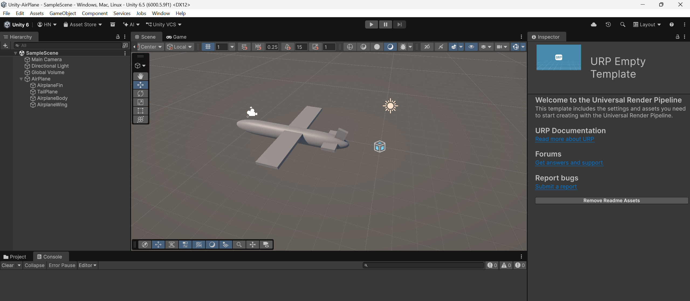

Nộp bài tập tuần 1
Slide 14-20: Phần 1.2 - Basic Game Object Manipulation and Transformations

# Unity AirPlane

Project game may bay duoc xay dung bang Unity va Universal Render Pipeline (URP).
Du an hien dang o giai doan khoi tao, la nen tang de phat trien gameplay dieu khien may bay.

## Cong nghe

- Unity `6000.5.9f1`
- Universal Render Pipeline `17.5.0`
- Input System `1.20.0`
- Scene chinh: `Assets/Scenes/SampleScene.unity`

## Ket qua bai tap

